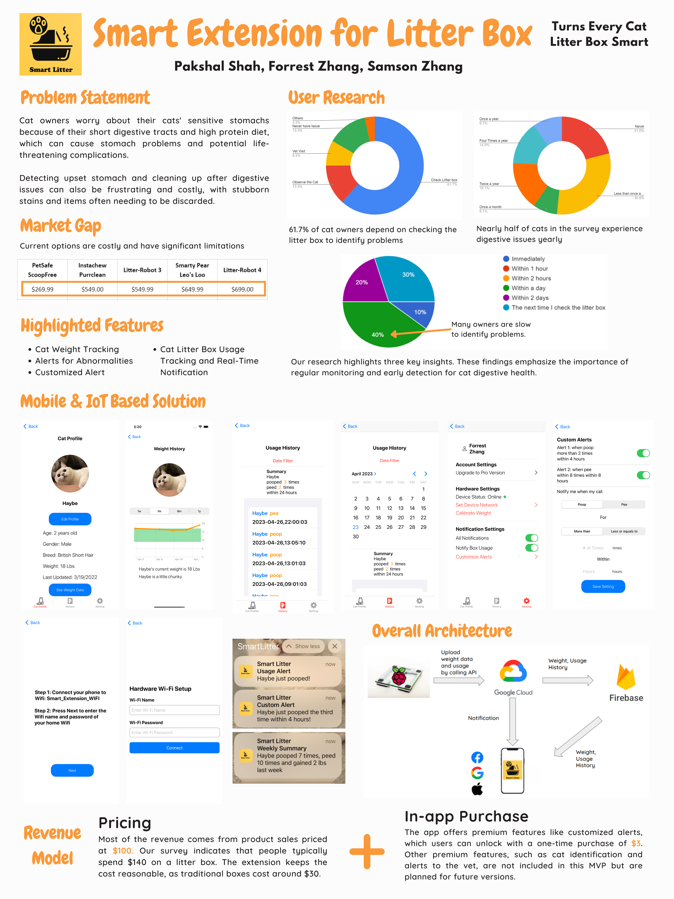

# Smart Extension for Cat Litter Box

## Contributor
Pakshal Shah | pakshals@andrew.cmu.edu\
Forrest Zhang | yunyuz@andrew.cmu.edu\
Samson Zhang | zhongzha@andrew.cmu.edu

## Course Details
This is a semester project for the Mobile and IoT Computing Services course (17-781) at Carnegie Mellon University.\
Instructor: Prof. Norman Sadeh
